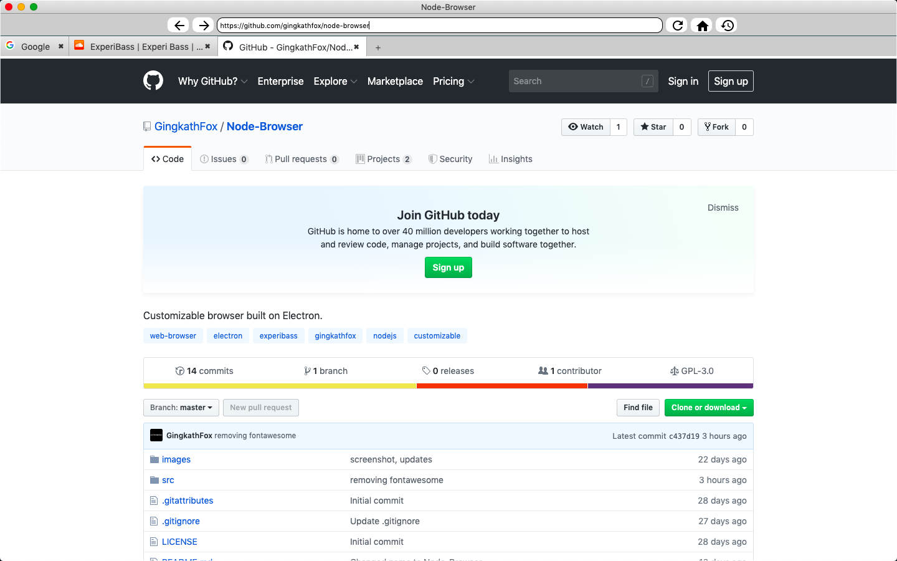
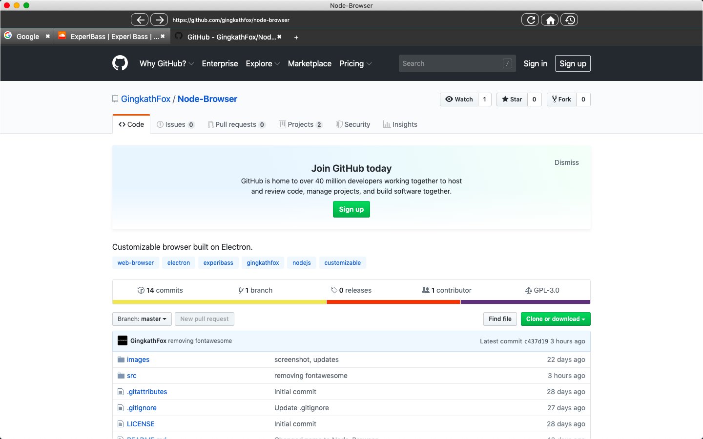

# Node-Browser
 Customizable browser built on Electron.
 
 # WIP
 
 This is a big ol WIP, i dont think ill ever finish it -w-
 Basically, all it can do is load web pages and play audio/video. No history, bookmarks, none of that. ~~its not a bug, its a feature! :D~~

 Light:

 

 Dark:

 
 ## TODO
 
- [x] Change buttons to images
- [ ] Load website icons better
- [ ] Stop multi-triggering listeners
- [ ] Load pages themselves quicker

Button images yoinked from [Google Material Design Icons](https://github.com/google/material-design-icons/)
